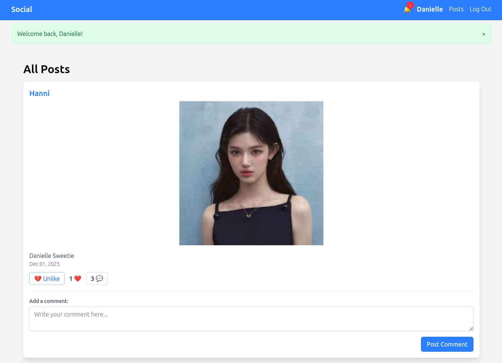
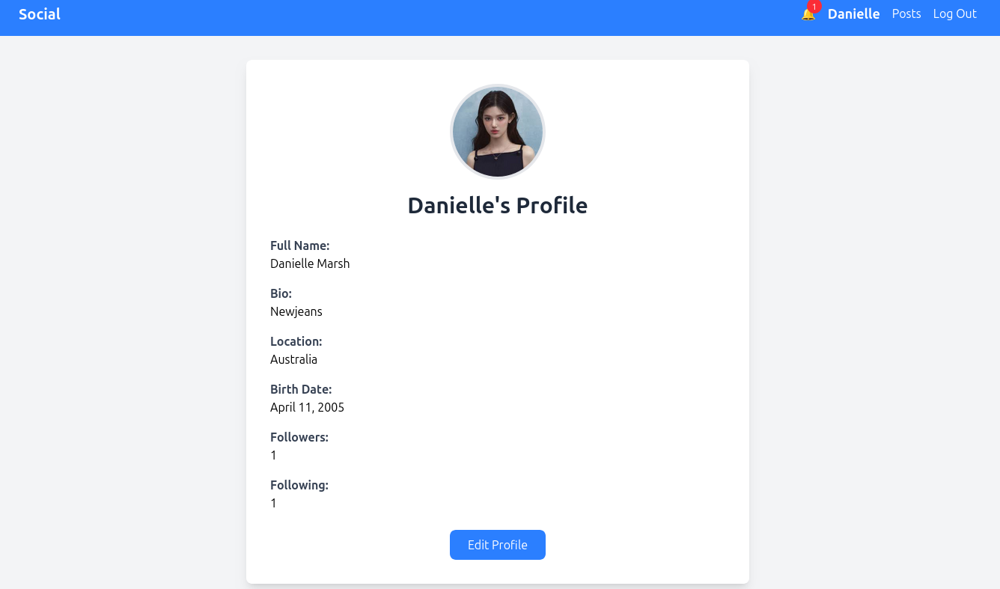
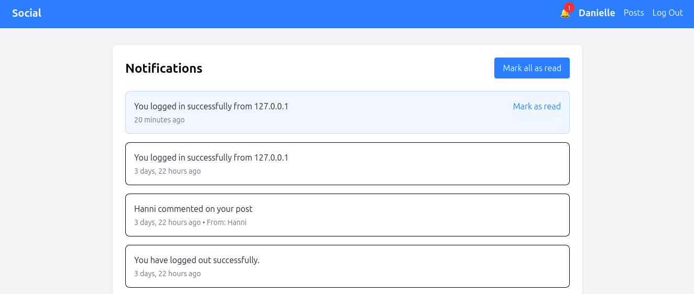

# Django Social Media App

A fully-featured social media platform built with **Django 5**. Connect with friends, share posts, like and comment, and stay updated with real-time notifications.

## 🌟 Features

### 🔐 Authentication & Profiles

* Custom user model with profile pictures
* User registration, login, and logout
* Profile editing with bio, location, and birth date
* Profile picture upload with unique UUID naming

### 👥 Social Features

* Follow / unfollow system
* User profiles with followers and following counts
* View other users’ profiles and posts

### 📱 Posts & Content

* Create, read, update, and delete posts
* Image upload support for posts
* Post likes system with AJAX functionality
* Comments on posts
* User-specific post feeds

### 🔔 Real-time Notifications

* Notification system for user interactions
* Notifications for likes, comments, and follows
* Unread notification count in the navigation bar
* Mark notifications as read
* Context processors for global notification access

### 🎨 Modern UI

* Responsive design with Tailwind CSS
* Clean and intuitive interface
* User-friendly navigation
* Real-time like updates without page refresh

## 🖼️ Screenshots

### Home Feed

### User Profile

### Notifications

## 🚀 Quick Start

### Prerequisites

* Python 3.8+
* PostgreSQL (recommended) or SQLite (for development)
* `pip` package manager

---